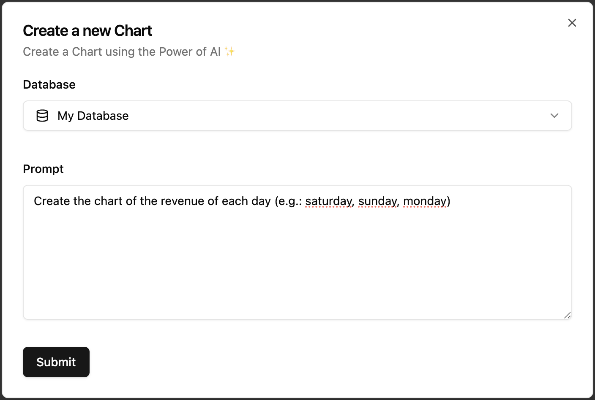
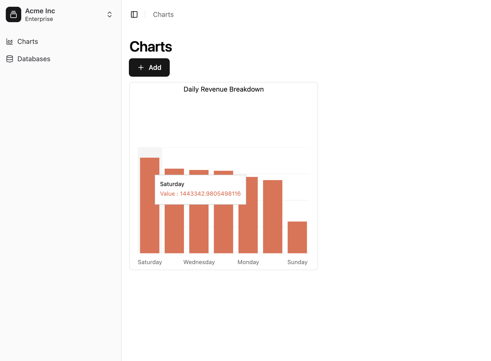

# ChartAI

This project leverages Large Language Models (LLMs) to create dynamic, custom charts based on user prompts. The system intelligently interprets user input, queries the database, and visualizes the requested data in a clear and meaningful way, providing a seamless and interactive experience for data analysis.

## How it works
#### 1. Ask the AI

#### 2. Get your Chart

## Tech stack:
- Golang
- Vite + Shadcn
- GPT 4o Mini / Claude 3.5
- Postgres

